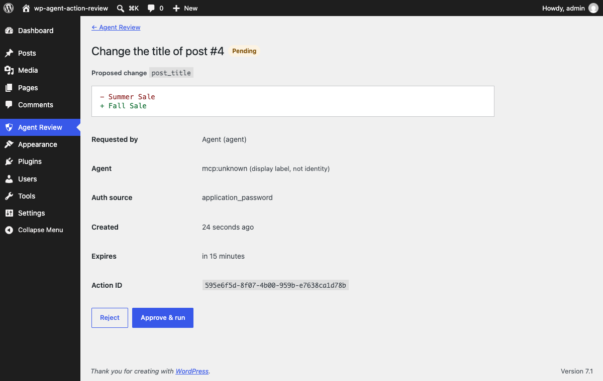
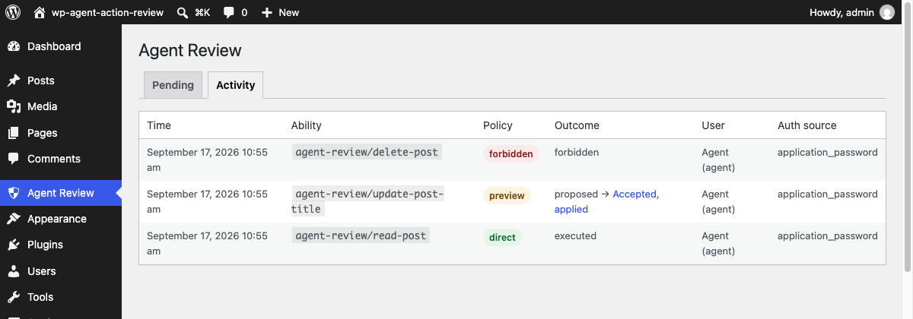

# Agent Action Review

[](https://github.com/mateusgetulio/wp-agent-action-review/actions/workflows/ci.yml)

A small WordPress plugin that turns agent write operations into reviewable, one-time pending actions before they can change the site. It is a reference consumer of the approval primitives in [Agents API](https://github.com/Automattic/agents-api), reached by a real agent through the [WordPress MCP Adapter](https://github.com/WordPress/mcp-adapter).

> Authorization says what the agent is allowed to request. Policy says whether it may happen directly, needs human review, or is forbidden. Approval says a human agreed to this exact proposal. Execution still rechecks current authority and current state.



## What it demonstrates

An agent connected over MCP asks for three things:

| Ability | Policy | What happens |
|---|---|---|
| `agent-review/read-post` | `direct` | Runs immediately |
| `agent-review/update-post-title` | `preview` | Nothing changes. A pending action is stored and the agent gets Agents API's `approval_required` envelope. A person reviews the diff in wp-admin and approves or rejects it |
| `agent-review/delete-post` | `forbidden` | Refused before any handler code runs. If a site ever allows it, it only moves the post to the trash, and refuses when the trash is disabled |

The Activity screen then shows all three decisions together.



## Built on

| Piece | Version | Role here |
|---|---|---|
| [Automattic/agents-api](https://github.com/Automattic/agents-api) | v0.11.2 (`1c07ed4`) | `WP_Agent_Action_Policy_Resolver`, the `direct` / `preview` / `forbidden` vocabulary, `WP_Agent_Pending_Action`, its statuses and store contract, the approval envelope |
| [WordPress/mcp-adapter](https://github.com/WordPress/mcp-adapter) | v0.6.1 (`23cb53e`) | Exposes the abilities to MCP clients over HTTP |
| Abilities API | WordPress 7.0+ core | Ability registration, input schemas, permission callbacks |

Agents API supplies contracts and leaves "database tables, REST routes, abilities or tool surfaces, chat/admin UI, permission ceilings ... and product-specific apply/reject handlers" to consuming products. This plugin is that consumer layer: a store table, three abilities, an executor, a review handler and three admin screens.

Agents API's own README still mentions `0.1.x` tags while releases are at `0.11.x`, so both dependencies are pinned by commit and checksum in `bin/fetch-deps.sh`. The WordPress 7.0 floor comes from Agents API; MCP Adapter needs 6.9.

## How it works

```
Claude Code
    │ MCP over HTTP, application password of an Editor "agent" user
    ▼
MCP Adapter  →  ability permission_callback  →  Executor
                                                  │ asks WP_Agent_Action_Policy_Resolver
                    ┌─────────────────────────────┼──────────────────────────────┐
                 direct                        preview                       forbidden
          authorize → apply            store WP_Agent_Pending_Action      WP_Error, handler
                                       return approval_required           never called
                                                  │
                                    wp-admin reviewer (browser session)
                                    nonce + manage_options + edit_post
                                    + not the requesting account
                                                  │
                         consistency check → freshness check → claim pending → accepted
                         → creator capability recheck → freshness recheck → apply
                         → resolution_result or resolution_error
```

Agents API does not intercept ability calls. The executor is what enforces the policy: it asks the resolver on every call, fails closed to `forbidden` on anything unexpected, and decides `forbidden` before any handler code runs.

## Security model

1. **A preview action never changes WordPress before a person accepts it.**
2. **An approval only runs the exact stored proposal.** The approve request carries only a server-generated action ID. Everything applied is reloaded from the stored row, and the input was normalized once when proposed, so the title the reviewer saw is the title that is written.
3. **The agent cannot approve itself.** Approval needs a valid wp-admin nonce from a logged-in session, `manage_options`, `edit_post` on the post, and a reviewer account different from the requesting account. The resolver identity comes from the session, never from the request. (One person could control two accounts; what is enforced is separation between accounts.)
4. **Permission is checked again right before applying**, for the account that requested the change. Approval means a person agreed; authorization means the requester is still allowed.
5. **A stale proposal is refused.** A fingerprint of the post's modified time, title and status is stored with the proposal and compared at review time and again immediately before applying.
6. **A pending action leaves `pending` only once.** The claim is a single conditional `UPDATE`, so two reviewers clicking at the same moment cannot both win, and results are write-once.
7. **An accepted action with no recorded result is shown as "Accepted, outcome unknown: check the post"** and is never retried automatically.
8. **Forbidden actions never reach their handler.**

Each rule has integration tests running against the real dependencies.

`accepted` means the reviewer accepted. Whether applying worked is in `resolution_result` or `resolution_error` (`permission_revoked`, `resource_changed`, `apply_failed`). Proposals refused before the claim move to `expired` with `resource_changed`, `policy_forbidden` or `inconsistent_state`. Only the upstream statuses are used.

### Why approvals do not go through `agents/resolve-pending-action`

Agents API registers a canonical `agents/resolve-pending-action` ability that uses whatever store and resolver a plugin supplies through filters. Its `resolver` input is caller-supplied, which is the subject of [agents-api#489](https://github.com/Automattic/agents-api/issues/489): an agent credential with enough capability could record an approval in someone else's name. This plugin does not register its store or resolver on those filters, so that ability stays inert, and approvals only happen through the wp-admin handler above.

### Why not rely on the client asking the user

Client confirmation and server authorization are different trust boundaries. MCP tool annotations such as `destructiveHint` are advisory, and a buggy or malicious client should not be able to bypass server policy. The server decides whether an action is direct, needs review or is forbidden.

### What is metadata, not identity

The agent label (`mcp:unknown`, since MCP Adapter 0.6.1 does not keep the client name after `initialize`) and `auth_source` (`application_password`, `user`, `browser_session`) are recorded for display and audit only. Authorization and the self-approval check use the WordPress user ID.

## Known limitations

- **The final race.** A concurrent edit that lands after the last freshness check and before `wp_update_post()` can still race the apply. The two checks shrink that window to milliseconds; removing it would need conditional, transactional mutation that WordPress's post API does not provide, and writing raw SQL would skip core hooks and revisions.
- **The update runs in the reviewer's session.** `wp_update_post()` is called during the reviewer's wp-admin request, so the revision author, KSES filtering and any `save_post` hooks see the reviewer, not the requesting account. The requester's permission is checked separately just before.
- **Outcome unknown after a crash.** Claiming and applying cannot share a transaction. If PHP dies after the claim and before the result is recorded, the action stays "Accepted, outcome unknown" for a person to check.
- **The request digest is not tamper-proof.** It detects inconsistent or corrupted stored state. Someone who can write the database can rewrite the input and the digest together; that would need an HMAC with a server secret, deliberately left out.
- **No MCP elicitation.** Approval happens in wp-admin, not inside the MCP client. [mcp-adapter#316](https://github.com/WordPress/mcp-adapter/pull/316) adds elicitation for direct tools but not for ability-backed tools.
- **`denied` is defense in depth.** A user without the capability is stopped by the ability's permission callback before the executor runs, so those calls are not logged. The executor checks again because the `wp_ability_permission_result` filter can override a permission callback.
- **Narrow on purpose:** title changes only, no approval memory ("always allow"), no retention purge for the event log or stored proposals, single site.
- **Tested with WordPress 7.1 and PHP 8.1 and 8.3.**

## Run it

Needs Docker, Node.js, PHP 8.1+ and Composer.

```sh
git clone https://github.com/mateusgetulio/wp-agent-action-review.git
cd wp-agent-action-review
composer install
composer deps
npx @wordpress/env@11.15.0 start
```

`start` creates an Editor user `agent`, a published post "Summer Sale", and an application password for the agent, and writes `.demo/connect-claude-code.sh` (git-ignored).

- Site: http://localhost:8881
- Agent Review screen: http://localhost:8881/wp-admin/admin.php?page=agent-action-review (user `admin`, password `password`)

### Connect Claude Code

```sh
.demo/connect-claude-code.sh
```

It runs `claude mcp add --transport http agent-review http://localhost:8881/wp-json/mcp/mcp-adapter-default-server` with a Basic auth header for the `agent` user. Then, in Claude Code:

1. "Read the Summer Sale post." It runs immediately.
2. "Rename it to Fall Sale." Claude reports that approval is required. Open Agent Review in wp-admin, check the diff, and click Approve & run.
3. "Delete the post." Claude reports that the action is forbidden. The post stays.
4. Open the Activity tab.

## Tests

```sh
composer lint
composer phpcs
composer phpstan
composer test               # unit tests, no WordPress
bin/integration-tests.sh    # WordPress test suite inside wp-env, with Agents API and MCP Adapter loaded
```

CI runs all of it on GitHub Actions, including the integration tests in wp-env.

## Layout

```
agent-action-review.php   plugin header, autoloader, activation
src/Plugin.php            dependency check, storage version, wiring
src/Actions/              the three handlers: normalize, authorize, describe, fingerprint, apply
src/Policy/Executor.php   policy resolution and enforcement, proposals
src/Pending/              pending action store, request digest, resource fingerprint
src/Review/               approve and reject
src/Admin/                Pending, Review and Activity screens
src/Audit/EventLog.php    metadata-only decision log
src/Abilities/            ability registration
bin/                      pinned dependency fetch, demo setup, integration test runner
tests/                    unit and integration tests
```

## License

GPL-2.0-or-later.
